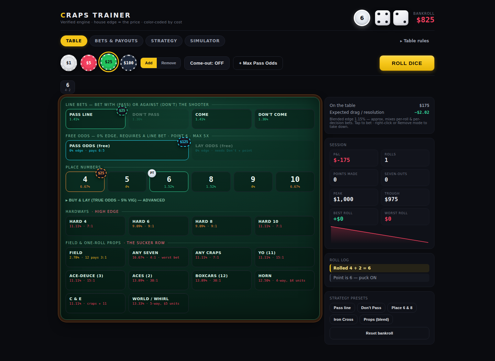

<div align="center">

# 🎲 Craps Trainer

**Learn every craps bet, its exact payout, and its true house edge — on a real-feel felt with a genie coach that explains the math.**

[](https://zeusnightbolt.github.io/CrapsTrainer/)

[](https://github.com/ZeusNightBolt/CrapsTrainer/actions/workflows/deploy.yml)
[](test/simulate.js)
[](package.json)
[](LICENSE)



</div>

> Every craps wager is negative-EV, so no system can beat it. This trainer does the opposite of selling one:
> it makes the edge **visible** on every bet and teaches the only decision that matters — **how much variance
> to buy for a fixed, tiny expected cost.** Every payout is Monte-Carlo-verified before it ships.

## ✨ Features

| | |
|---|---|
| 🎰 **Real craps mat** | One full side of a live table — point boxes, COME, FIELD, DON'T PASS, an outlined PASS LINE, and the center prop block. Aspect-locked + container-query scaled to **fit any screen** (iPhone Pro Max → desktop) with no scrolling. |
| 👆 **Tactile betting** | **Tap** a region to bet · **double-tap** to take it down · **Undo** or **Reset $** any time · tap a riding Come/DC chip to add odds. Black-and-gold dice tumble ~1.1s before the reveal. |
| 🃏 **Result flash card** | After every roll, a summary card states the net **win / loss / push** big and clear — the dice, what just happened (point made, seven-out, natural…), which bets won and lost, and the coach's one-line *why*. |
| 🧞 **Coach genie + memory** | A bottom-right chat bubble that reads the felt and **explains the logic** — no amounts, no auto-betting. It also **remembers how you play** (persisted locally): your favourite bets, how your action splits across the table, and the expected house-edge cost of each lane, so the advice is about *you*. |
| 🎲 **Learn — the dice math, visualized** | The full **36-outcome distribution** drawn as the 1·2·3·4·5·6·5·4·3·2·1 pyramid (every combination shown as real pips), plus the **race-to-the-point** table connecting each number's ways to its true-odds payout. Generated from the same enumeration the engine uses. |
| 🎯 **Next-roll panel** | Net P&L for every total 2–12, computed by running the real engine over all 36 dice combos — see what each number does to your stack *before* you throw. |
| ⚙️ **Table rules** | Live-wired variants: max odds `1× → 100×`, Field `12 pays 2:1 / 3:1`, Buy/Lay vig `on-win / always`. |
| 📊 **Bets & Payouts** | Every bet ranked by house edge for the active rules, with both Pass- and Don't-side odds ladders. |
| 📖 **Strategy** | Tiered breakdown, variance/bankroll sizing, corrected decisions-per-hour, and why "systems" (Iron Cross, hedging, dice setting) are illusions. |
| 🧪 **Simulator** | Monte-Carlo thousands of sessions per strategy through the same engine — mean, median, SD, percentiles, bust rate, full histogram. |
| 📱 **Phone-first** | Thumb-reach roll bar, haptics, recent-rolls strip, safe-area layout, reduced-motion support. |

## 📉 House edge, at a glance

| Bet | Pays | Edge | | Bet | Pays | Edge |
|---|---|---|---|---|---|---|
| Odds (any point) | true | 🟦 **0.00%** | | Field (12→2:1) | 1:1/2:1 | 🟠 5.56% |
| Don't Pass / Come | 1:1 | 🟢 **1.36%** | | Place 4 / 10 | 9:5 | 🟠 6.67% |
| Pass Line / Come | 1:1 | 🟢 **1.41%** | | Big / Hard 6 · 8 | 1:1/9:1 | 🟠 9.09% |
| Place 6 / 8 | 7:6 | 🟢 1.52% | | Hard 4/10, Craps, Yo | 7:1/15:1 | 🔴 11.11% |
| Buy 4 / 10 | 2:1−5% | 🟢 1.67% | | Horn / World | combo | 🔴 12.5–13.3% |
| Field (12→3:1) | ⋯/3:1 | 🟡 2.78% | | Aces / Boxcars | 30:1 | 🔴 13.89% |
| Place 5 / 9 | 7:5 | 🟡 4.00% | | **Any Seven** | 4:1 | 🔴 **16.67%** |

**Free odds dilute the line edge** → Pass + 3-4-5× ≈ `0.37%`, + 10× ≈ `0.18%`, + 100× ≈ `0.02%`. Don't Pass + 3-4-5× lay ≈ `0.27%`.

## ✅ Why you can trust the numbers

`npm run verify` gates CI — a payout that drifts from theory fails the deploy. It runs three layers:

1. **Dice source-of-truth** — a 3M-roll fairness pass (each face ≈ 1/6, each total ≈ ways/36) plus a check that the Learn tab's dice-math module (`src/diceMath.js`) is internally sound and matches the theory.
2. **Per-bet Monte-Carlo** — every bet family simulated to convergence vs. published figures.
3. **Come / Don't-Come lifecycle sims** — box → travel → resolution, asserting the 1.41% / 1.36% edges.
4. **Exact-payout rule checks** — the fiddly cases averages hide (come-odds off = no-action, winner comes down, bar-12 push, hardways idle when off).

All edges derive from the 36-outcome dice space and corroborate [Wizard of Odds](https://wizardofodds.com/games/craps/).

## 🚀 Quick start

```bash
git clone https://github.com/ZeusNightBolt/CrapsTrainer.git && cd CrapsTrainer
npm install && npm run dev        # → http://localhost:5173
```

| Command | Does |
|---|---|
| `npm run dev` | Local dev server |
| `npm run build` | Production build → `dist/` |
| `npm run verify` | Monte-Carlo engine verification (gates CI) |

## 🧩 Use the engine standalone

`src/engine.js` is pure and UI-agnostic:

```js
import { newGame, resolve } from "./src/engine.js";
let game = newGame(1000);          // { phase, point, bankroll, working, bets }
game.bets.passline = 25;
const out = resolve(game, 3, 4);   // roll 3+4 → { state, payout, events, roll }
// 4th arg selects rules: resolve(game, d1, d2, { fieldTriple: true, vigAlways: false })
```

<details>
<summary>📚 <b>Research notes</b> — where common summaries are wrong</summary>

- **Vig-always ≠ flat 4.76%.** On a per-resolution basis it's `vig × P(lose)` for Buy (3.33/3.00/2.73%) and `layOdds × vig × P(number)` for Lay (0.83/1.33/1.89%) — cheaper than vig-on-win for Lay, pricier for Buy. Both verified.
- **Decisions/hr ≠ rolls/hr.** Line bets take ~3.4 rolls to resolve, so pricing hourly cost off ~100 rolls overstates it ~3×.
- **A winning come bet is paid _and taken down_** — it doesn't ride the number like a place bet.
- **Dice setting** has no controlled evidence; casinos require the randomizing back wall specifically to defeat it.
- **World/Whirl's 7 is a wash**, not a win — strictly worse than the Horn it's pitched to upgrade.

Sources: [Craps](https://wizardofodds.com/games/craps/) · [edge per bet vs. per roll](https://wizardofodds.com/games/craps/appendix/2/) · [3-Point Molly](https://wizardofodds.com/gambling/three-point-molly/) · [dice setting](https://wizardofodds.com/ask-the-wizard/craps/dice/)
</details>

<details>
<summary>🗂 <b>Project structure</b></summary>

```
src/
├── App.jsx           game state, controls, session stats
├── engine.js         pure resolution engine (verified, UI-agnostic)
├── coach.js          advisory genie — pure fn of (game, rules, memory)
├── coachMemory.js    persistent player profile — what you bet & what it costs
├── diceMath.js       36-outcome dice enumeration (Learn viz + coach)
├── outcomes.js       next-roll P&L over all 36 dice combos
├── bets.js           bet reference + odds ladders (rules-aware)
├── util.js           edge→color ramp, formatting, odds caps
├── styles.css        casino-feel styling, mobile-first
└── components/       Table · CoachGenie · RollResultCard · DiceMath · NextRoll · Simulator · Strategy · BetsReference · Rail · MobileBar · RulesPanel · Dice · Sparkline
test/simulate.js      Monte-Carlo + exact-payout verification (gates CI)
.github/workflows/    verify + build on push/PR · deploy to Pages on main
```
</details>

## 🌐 Deploy

Hosted on **GitHub Pages** → **<https://zeusnightbolt.github.io/CrapsTrainer/>**. Every push/PR to `main` runs verify + build; pushes to `main` publish `dist/`. `vite.config.js` uses `base: "./"`, so any static host works with build `npm run build`, output `dist`.

---

<sub>🎓 Educational only. Craps is negative-expectation; no bet or system has a positive edge, and nothing here is gambling advice. · MIT © [LICENSE](LICENSE)</sub>
